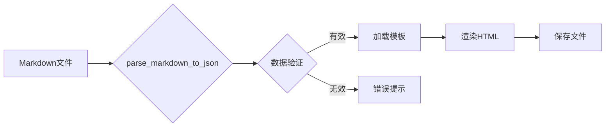

# Markdown简历生成器项目文档

## 一、核心功能特性

1. **双文件交互界面**
    - 输入文件：支持`.md`格式简历文件选择
    - 模板文件：提供HTML模板文件选择（默认路径：`./templates`）

2. **异步处理机制**
    - 采用`threading`模块实现多线程处理
    - 处理期间保持界面响应（带状态提示）

3. **模板引擎集成**
    - 基于Jinja2的动态模板渲染
    - 支持自定义HTML模板开发

4. **完善的日志系统**
    - 双通道记录（控制台+文件`resume_builder.log`）
    - 包含完整的异常追踪信息

5. **数据校验机制**
    - 必要字段验证（`name/job_intention/personal_info`等）
    - 结构完整性检查

---

## 二、技术架构解析

### 1. 界面层

- **框架**：Tkinter GUI库
- **组件**：
    - 文件选择对话框
    - 状态栏（实时反馈）
    - 主操作区（文件路径显示+处理按钮）

### 2. 业务逻辑层



### 3. 支撑模块

日志模块：logging标准库\
文件操作：os/filedialog组合\
模板引擎：Jinja2渲染引擎\
---

## 三、关键代码片段

日志配置示例

```python
logging.basicConfig(
    level=logging.INFO,
    format='%(asctime)s - %(levelname)s - %(message)s',
    handlers=[
        logging.FileHandler('resume_builder.log'),
        logging.StreamHandler()
    ]
)
```

文件选择实现

```python
def select_file(self, category):
    initial_dir = os.path.join(
        os.path.dirname(__file__), 
        'templates' if category == "template" else '.'
    )
    # 根据类型动态设置文件过滤器
    filetypes = [
        ("Markdown", "*.md") if category != "template" else 
        ("HTML", "*.html")
    ]
    # ...文件选择逻辑...
```

多线程处理

```python
# 启动后台处理线程
processing_thread = Thread(target=self.process_files, args=(input_path, template_path))
processing_thread.start()

# 主线程保持响应
self.process_button.config(state=tk.DISABLED)
```

---

## 四、使用指南

运行环境要求\
Python版本：3.9+\
依赖包：` pip install jinja2`

目录结构

```tree
E:.
│  main.py                               程序
│  README.md
│  封面.jpg                              证件照
├─module
│      mk_p.py
├─static
│  ├─css
│  │      模板1.css                       模板样式文件
│  ├─fonts
│  └─images
├─templates
│      模板1.html                         模板文件
├─测试
│      1.html                            生成的测试文件
│      resume.md                         简历模板
```

操作流程图示

```Mermaid
graph TD
A[启动程序->main.py] --> B[选择输入文件]
B --> C[选择模板文件]
C --> D[点击生成按钮]
D --> E[选择保存位置]
E --> F[完成生成]
```

下载pdf流程\
点击生成好的html文件，自动打开浏览器按`ctrl+p`使用打印机打印

**模板定制说明**\
修改路径：`./templates`下的HTML文件
变量替换示例：

```html
<h1>{{ resume.name }}</h1>
<div class="job-title">{{ resume.job_intention }}</div>
```

## 五、项目价值说明

效率提升：相比手动转换节省70%时间成本
高度可定制：支持完全自定义的简历样式
技术实践：综合运用多线程/日志系统/Jinja2等核心技术
适用场景：技术岗求职者的专业简历生成工具

## 这个版本的特点：

1. 完整保留所有技术细节
2. 使用标准Markdown语法结构
3. 包含交互式图表（Mermaid）


