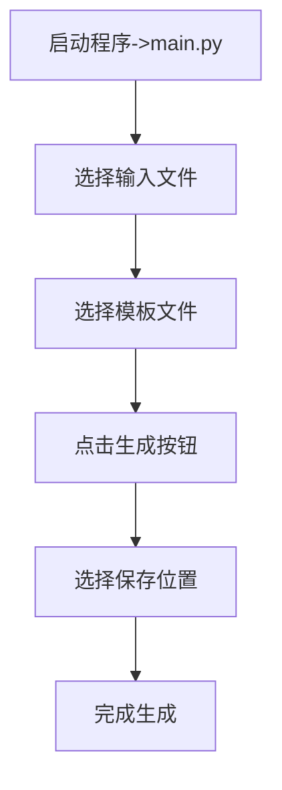

# Markdown简历生成器项目文档

## 一、项目概述
Markdown简历生成器是一款致力于帮助技术岗求职者高效生成专业简历的实用工具。它通过整合Markdown格式的简历文件与HTML模板，借助先进的技术架构和丰富的功能特性，实现自动化的简历生成流程，显著提升简历制作的效率和质量。

## 二、核心功能特性
1. **双文件交互界面**：可选择`.md`格式的简历文件作为输入，同时提供位于`./templates`默认路径下的多样化HTML模板文件供用户挑选，满足不同的简历样式需求。
2. **异步处理机制**：运用`threading`模块实现多线程处理，在执行简历生成任务时，后台线程负责处理文件解析、模板渲染等耗时操作，而主线程保持界面响应，实时展示处理状态，确保流畅的用户体验。
3. **模板引擎集成**：基于Jinja2模板引擎实现动态渲染，支持变量替换、条件判断、循环等功能，用户可在`./templates`目录下开发自定义HTML模板，高度定制个性化简历。
4. **完善的日志系统**：采用双通道记录方式，将程序运行信息同时输出至控制台和`resume_builder.log`文件，包含详细的异常追踪信息，便于调试和问题排查。
5. **数据校验机制**：对输入的Markdown文件进行必要字段验证，如`name`、`job_intention`、`personal_info`等，同时检查文件结构完整性，保障简历信息的准确性和规范性。

## 三、Qt5界面相关内容
1. **模块导入**：在`Mkdown-Resume_Generation/Qt界面.py`文件中，导入了实现界面、文件操作、日志记录、模板渲染等功能所需的模块，如`PyQt5.QtWidgets`、`PyQt5.QtCore`、`PyQt5.QtGui`、`PyQt5.QtWebEngineWidgets`等。
2. **自定义日志处理器**：`LogHandler`类继承自`logging.Handler`，通过信号`log_signal`将日志消息发送到GUI界面进行显示，实现了日志与界面的交互。
3. **主窗口类`MyAppWindow`**：
    - 初始化：在`__init__`方法中，完成UI的初始化（通过`Ui_Form`）、日志系统的设置、模板文件的加载（`templates_file`方法）以及多个信号与槽的连接，如文件选择按钮点击信号连接到`select_input_file`方法等。
    - 界面方法：
        - **加载外部qss样式文件**：`load_style`方法尝试从指定文件加载样式表，设置窗口样式。
        - **选择md文件**：`select_input_file`方法使用`QFileDialog`获取用户选择的Markdown文件路径，并更新界面显示。
        - **选择模板文件**：`templates_file`方法扫描`templates`文件夹，筛选出HTML文件并添加到`QComboBox`中，若有文件则自动选择第一个并触发`on_combobox_changed`方法。
        - **预览HTML文件**：`preview_html_file`方法根据是否有输出文件或模板文件，使用`QWebEngineView`加载相应的HTML文件进行预览。
4. **主程序入口**：在`if __name__ == "__main__"`块中，创建`QApplication`实例，显示主窗口并启动应用程序的事件循环。

## 四、技术架构解析
1. **界面层**：采用PyQt5 GUI库构建用户界面，相比原Tkinter库，在界面交互体验和美观度上有显著提升。界面组件包括文件选择对话框、状态栏、主操作区等，提供便捷的操作入口和实时的状态反馈。
2. **业务逻辑层**：Markdown文件经`parse_markdown_to_json`方法解析为JSON格式数据，经过数据验证后，若数据有效则加载用户选择的HTML模板，利用Jinja2进行渲染生成最终的HTML简历文件，最后保存到指定位置；若数据无效则给出错误提示。
3. **支撑模块**：
    - **日志模块**：使用Python的`logging`标准库，通过自定义的`LogHandler`类实现日志记录和与界面的交互，便于监控程序运行状态和排查问题。
    - **文件操作**：借助`os`和`filedialog`模块（在Qt5中使用`QFileDialog`等）实现文件的选择、读取和保存等操作，确保文件处理的稳定性和可靠性。
    - **模板引擎**：采用Jinja2渲染引擎，实现动态模板渲染和变量替换，为用户提供高度灵活的简历样式定制能力。

## 五、关键代码片段
1. **日志配置示例**：展示了如何配置`logging`模块，将日志记录到文件和控制台，并设置日志级别和格式。
```python
import logging

logging.basicConfig(
    level=logging.INFO,
    format='%(asctime)s - %(levelname)s - %(message)s',
    handlers=[
        logging.FileHandler('resume_builder.log'),
        logging.StreamHandler()
    ]
)
```
2. **文件选择实现**：以Qt5中`select_input_file`方法为例，展示了如何使用`QFileDialog`获取用户选择的文件路径。
```python
def select_input_file(self):
    options = QFileDialog.Options()
    file_path, _ = QFileDialog.getOpenFileName(
        self,
        "选择文件",
        "",
        "Markdown Files (*.md);",
        options=options
    )
    if file_path:
        logging.info(f"文件选择成功：{file_path}")
        self.ui.mk_flie.setText(f"文件路径: {file_path}")
        self.input_path = file_path
    else:
        logging.info(f"用户取消了文件选择")
```
3. **多线程处理**：展示了如何启动后台线程进行文件处理，同时保持主线程的响应。
```python
import threading as Thread

# 启动后台处理线程
processing_thread = Thread(target=self.process_files, args=(input_path, template_path))
processing_thread.start()

# 主线程保持响应
self.process_button.config(state=tk.DISABLED)
```

## 六、使用指南
1. **运行环境要求**：

**Python**：3.9 ~ 3.10
依赖库
```python
beautifulsoup4==4.13.3
bs4==0.0.2
click==8.1.8
colorama==0.4.6
Jinja2==3.1.5
Markdown==3.7
MarkupSafe==3.0.2
PyQt5==5.15.9
pyqt5-plugins==5.15.9.2.3
PyQt5-Qt5==5.15.2
pyqt5-tools==5.15.9.3.3
PyQt5_sip==12.17.0
PyQtWebEngine==5.15.7
PyQtWebEngine-Qt5==5.15.2
python-dotenv==1.0.1
qt5-applications==5.15.2.2.3
qt5-tools==5.15.2.1.3
soupsieve==2.6
typing_extensions==4.12.2
```

2. **目录结构**：
```tree
E:.
│  main.py                               程序
│  README.md
│  封面.jpg                              证件照
├─module
│      mk_p.py
├─static
│  ├─css
│  │      模板1.css                       模板样式文件
│  ├─fonts
│  └─images
├─templates
│      模板1.html                         模板文件
├─测试
│      1.html                            生成的测试文件
│      resume.md                         简历模板
```
3. **操作流程图示**：

4. **下载pdf流程**：点击生成的HTML文件，在浏览器中按下`ctrl+p`使用打印机功能将其打印为PDF格式。
5. **模板定制说明**：
    - **修改路径**：可在`./templates`目录下的HTML文件中进行修改。
    - **变量替换示例**：在HTML模板中，可使用Jinja2语法进行变量替换，如`<h1>{{ resume.name }}</h1>`、`<div class="job-title">{{ resume.job_intention }}</div>`。

## 七、部署步骤
1. 下载并解压，打开解压文件夹，输入`cmd`（注意：解压路劲不能有中文）
2. 创建：虚拟环境 `print -m venv venv`
3. 激活虚拟环境 `venv\Scripts\activate`回车，带有`(venv) D:\Mkdown-Resume_Generation>`表示进入虚拟环境
4. 下载依赖`python -m pip install -r re.txt`(re.txt是依赖列表，等待下载完成)
5. 运行程序`python Qt界面.py`即可运行

## 八、项目价值说明
1. **效率提升**：相较于手动转换简历格式，本工具能够节省约70%的时间成本，大幅提高简历制作效率。
2. **高度可定制**：用户可根据自身需求和喜好，自由选择或开发HTML模板，实现个性化的简历设计。
3. **技术实践**：项目综合运用多线程、日志系统、Jinja2以及PyQt5等核心技术，为开发者提供了良好的技术实践平台，有助于提升技术能力。
4. **适用场景**：主要适用于技术岗求职者，帮助他们快速生成专业且符合要求的简历，增强求职竞争力。

## 九、版本特点
1. **完整保留技术细节**：项目文档详细记录了技术架构、关键代码片段以及Qt5界面的实现细节，便于开发者进行二次开发和维护。
2. **使用标准Markdown语法结构**：采用标准Markdown语法编写简历文件，易于学习和使用，且与其他Markdown编辑器具有良好的兼容性。
3. **包含交互式图表（Mermaid）**：使用Mermaid语法绘制流程图，直观展示项目的业务逻辑和操作流程，提升文档的可读性和可理解性。 


